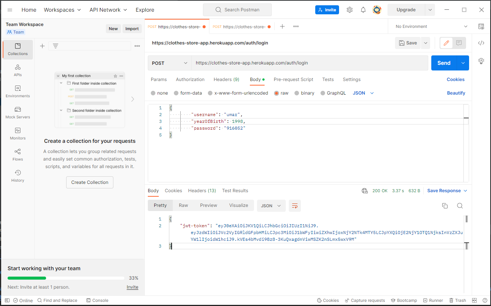
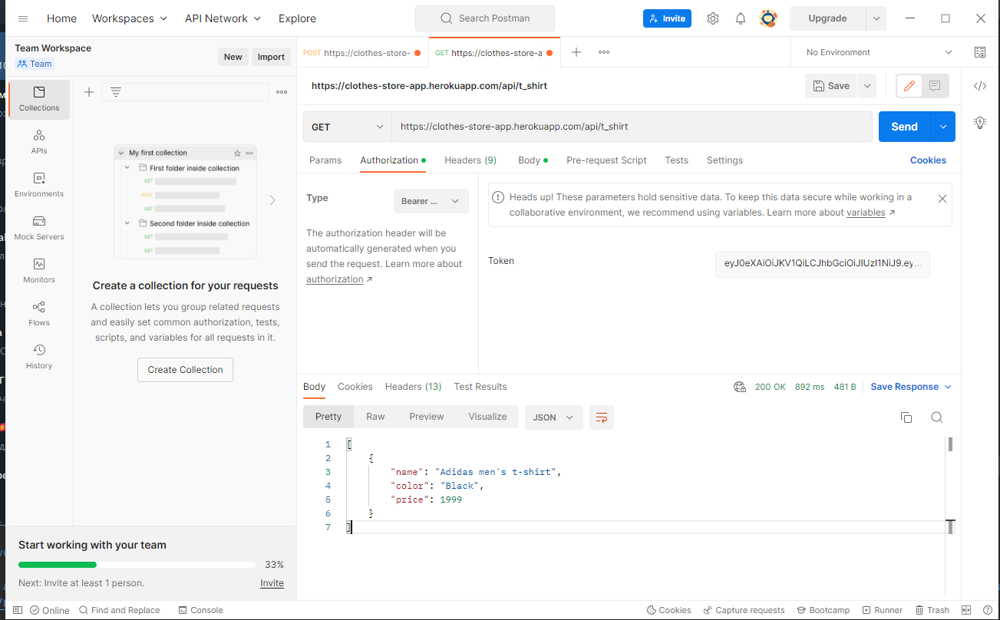
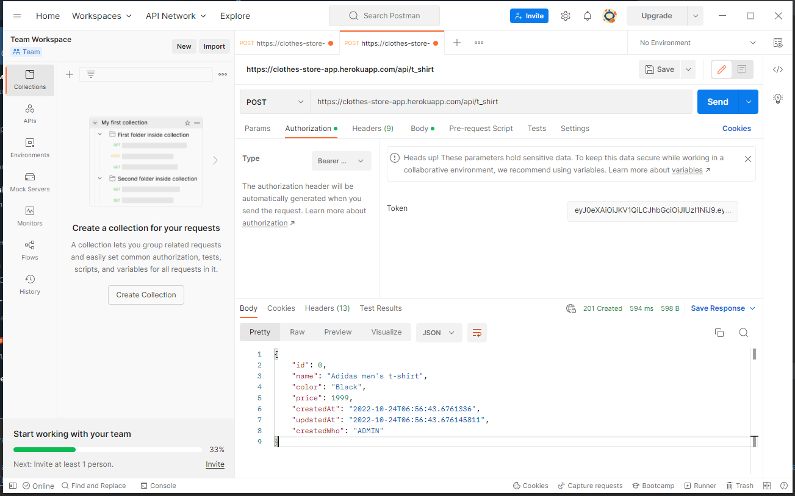
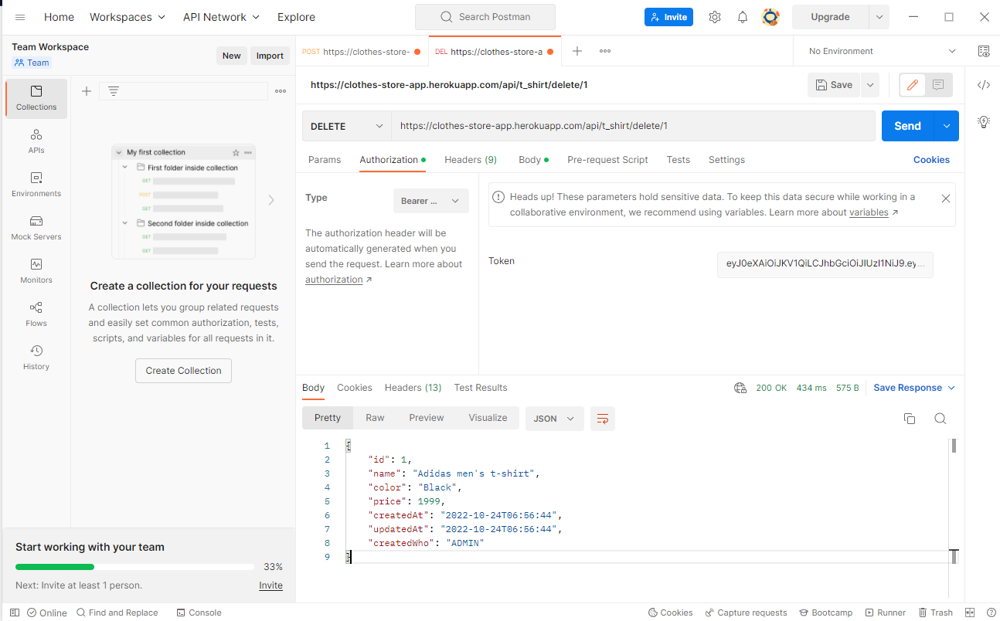

# Heroku link

<ul>
  <li><a href="https://clothes-store-app.herokuapp.com/hello">Clothes store</a></li>
</ul>

### User Authentication
 
  

### GET (with jwt token)

  

### POST Body

  

### DELETE

  
