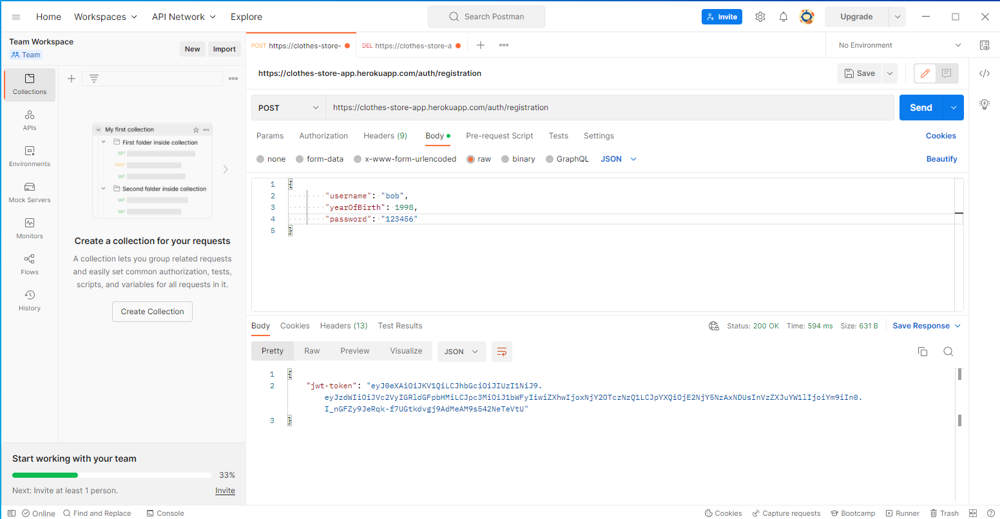

# Heroku link

<ul>
  <li><a href="https://clothes-store-app.herokuapp.com/hello">Clothes store</a></li>
</ul>

### User Registration and get jwt token! JWT Token Valid for 1 hour, then you need to log in again and get a new JWT
 
  

### User Authentication and get new JWT Token!
 
  

### GET (with jwt token)

  

### POST Body

  

### DELETE

  
